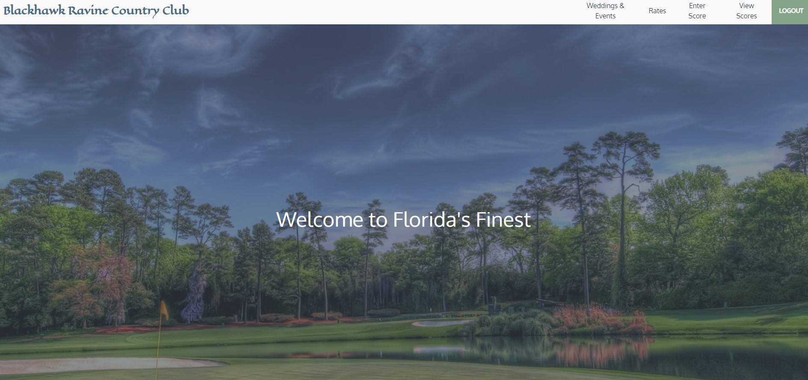

# Blackhawk Ravine Country Club

## Links
* Repository Link: [GitHub](https://github.com/ryanweiler92/Blackhawk-Ravine-Country-Club)
* Application Link: 
* For any additional questions please reach out to ryanweiler92@gmail.com

## Description
This application is for members of Blackhawk Ravine, a fictional golf course in Orlando, Florida. Users of this application can create an account to input their scores from Blackhawk Ravine and view all of their past scores. This application also displays information on the course including rates and different types of events. 

## Table of Contents
* [Technologies](#technologies)
* [Usage](#usage)
* [Contributors](#contributors)
* [License](#license)

## Technologies
Made with React, Tailwind CSS, MongoDB, Express, Apollo & GraphQL

## Usage

## Contributors
* [Ryan-Weiler](https://github.com/ryanweiler92)
I had some trouble with my original set of files which lead to losing a majority of the commit history on this repository. This app is entirely original despite the small commit history.

## License
